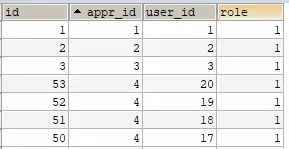

# 问题: 5.7 默认启用only_full_group_by模式造成以前版本不兼容问题

#### maven 项目报错
expression #2 of SELECT list contains nonaggregated column 'newhelp.appr.title'; this is incompatible with sql_mode=only_full_group_by'

#### 遇到错误的原因
这是因为随着MySQL版本更新带来的问题，在MySQL5.7版本之后对group by进行了优化。他默认启动了`ONLY_FULL_GROUP_BY`模式。
查看当前 `sql_mode`。
```
mysql> SELECT @@sql_mode ;
+-------------------------------------------------------------------------------------------------------------------------------------------+
| @@sql_mode                                                                                                                                |
+-------------------------------------------------------------------------------------------------------------------------------------------+
| ONLY_FULL_GROUP_BY,STRICT_TRANS_TABLES,NO_ZERO_IN_DATE,NO_ZERO_DATE,ERROR_FOR_DIVISION_BY_ZERO,NO_AUTO_CREATE_USER,NO_ENGINE_SUBSTITUTION |
+-------------------------------------------------------------------------------------------------------------------------------------------+
1 row in set (0.00 sec)
```
这种模式的官方解释：`ONLY_FULL_GROUP_BY`是MySQL数据库提供的一个sql_mode，通过这个sql_mode来保证SQL语句“分组求最值”合法性的检查。这种模式采用了与Oracle、DB2等数据库的处理方式。即不允许`select target list` 中出现语义不明确的列。
通俗的讲就是：对于用到GROUP BY的select语句，查出来的列必须是group by后面声明的列，或者是聚合函数里面的列。



```
select语句：select id, sum(appr_id) from appr group by id------------------------------------(合法)

select语句：select id, user_id, sum(appr_id) from appr group by id-------------------------(合法)

select语句：select id, sum(appr_id) from appr group by role----------------------------------(不合法)

select语句：select id, user_id, sum(appr_id) from appr group by role-----------------------(不合法)

select语句：select * appr group by id ----------------------------------------------------------------(不合法)
```

##### ONLY_FULL_GROUP_BY这种模式的特点
1. 只要有聚合函数sum()，count()，max()，avg()等函数就需要用到group by，否则就会报上面的错误。
2. group by id(id是主键)的时候，select什么都没有问题，包括有聚合函数。
3. group by role(非主键)的时候，select只能是聚合函数和role(group by的字段),否则报错

#### 解决问题的方案

##### 1. 命令行输入 临时更改重启失效

```
set @@GLOBAL.sql_mode='';

set sql_mode ='STRICT_TRANS_TABLES,NO_ZERO_IN_DATE,NO_ZERO_DATE,ERROR_FOR_DIVISION

_BY_ZERO,NO_AUTO_CREATE_USER,NO_ENGINE_SUBSTITUTION';
```

##### 2. 修改MySQL配置文件
在 my.cnf 文件中 mysqld 区域添加去掉 `ONLY_FULL_GROUP_BY` 模式的 `sql_mode`

```
[mysqld]
sql_mode=STRICT_TRANS_TABLES,ERROR_FOR_DIVISION_BY_ZERO,NO_AUTO_CREATE_USER,NO_ENGINE_SUBSTITUTION
```